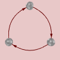
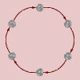
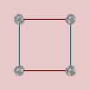
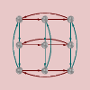
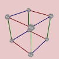
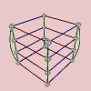
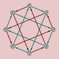
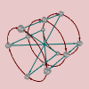
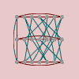
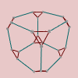

## Beginning Mathematical Discovery

This page suggests two different directions you can follow to some
enlightening illustrations about groups.  First, we'll talk about a basic
tip for how to get the most out of *Group Explorer.*  Then I'll give you a
taste of some of the value of visualization in group theory.

## Group info, all the way

The first time you see a [group info window](rf-um-groupwindow.md), the
amount of information it presents may be a bit overwhelming.  But take care
not to miss the section entitled "Computed properties."

For example, [click
here](http://nathancarter.github.io/group-explorer/GroupInfo.html?groupURL=groups/Z_6.group)
to visit the group info page for the group \(\mathbb{Z}_6\) and scroll down
to the "Computed properties" section.

That section contains much more information that it might at first seem to,
and I recommend taking some time to investigate it. Follow the "tell me
more" links and you'll find that *Group Explorer* will often tell you *much*
more.

## Class equations

For instance, click the "tell me more" link to the right of the class
equation in the group info page you opened. You will find all of the
following.

 * A link to [the definition of "class equation."](rf-groupterms.md#class-equation)
 * An explanation of why your group has the class equation it does.
 * Three links to different ways to visualize the class equation.
   As is an example, the class equation for \(D_5\) shown using
   cycle graphs creates an image like the one shown below.

   

A very important difference is that when you ask *Group Explorer* to
automatically generate the illustration, then the result is interactive.
You can manipulate each component of the illustration, unlike the static
image above.

CITE(VGT-7.5 MM-3.7 TJ-14.2)

## Subgroups

But far more deep information is available under the "tell me more" link next to the number of subgroups. Under that link you will find all of the following information.

 * A link that will show you the lattice of subgroups for your group,
   in any of several formats.
 * The name, index, and order of each subgroup of your group, in addition
   to an illustration of it as a group on its own, and an answer as to
   whether it is normal.
 * Links to see each of the illustrations as a large visualizer which
   you can edit.
 * For normal subgroups, links to diagrams witnessing the normality of the
   subgroup, using a short exact sequence of homomorphisms, which will
   contain the quotient group.
 * Whether your group is simple, and why.
 * Links to definitions of every term used on this list,
   as well as several others that show up.

In summary, do not ignore the computed properties of a group in its info
page! It is an excellent place to start learning about a group and to start
learning some group theory terminology in a fairly concrete context, with
definitions readily available.

CITE(VGT-6 MM-3.1 DE-4.1 TJ-3.3)

## "Getting" the Fundamental Theorem

Now let's get a taste of some of the power group theory visualization has
for building intuition.

The Fundamental Theorem of Abelian groups states that every abelian group is
simply a product of cyclic groups. From this, group theorists conclude that
abelian groups are less interesting to study than nonabelian groups, because
this theorem effectively completely classifies them. We understand them
thoroughly, through this theorem.

But the first-time you experience group theory, such a theorem may hardly
seem to give complete understanding of abelian groups. It may actually seem
rather opaque. Let's see how *Group Explorer* can show us what this theorem
means.

### Cyclic groups

The theorem says that abelian groups are products of cyclic groups. So then
we ask, what are cyclic groups? They are groups that are generated by one
element running in a cycle, hence the name. Their Cayley diagrams and cycle
graphs all look like circles, as shown below.  From left to right, we have
the Cayley diagrams of \(\mathbb{Z}_3\) and \(\mathbb{Z}_6\) followed by the
cycle graphs of \(\mathbb{Z}_8\) and \(\mathbb{Z}_{15}\).

If we ask *Group Explorer* to use a linear axis for displaying a cyclic
group, it stretches it out into a line, with one loop connecting the end of
the line to the beginning, like this.

Remember this image, because it is important below.

### Abelian groups

Let's take a look at the Cayley diagrams of some abelian groups. You can
tell which ones are abelian by looking at the "Abelian" computed property in
their group info page. Better still, in [the main
window](rf-um-mainwindow.md) you can show the "Abelian" column and see
yes/no for each group.  From left to right, we have the Cayley diagrams of
\(V_4\), \(\mathbb{Z}_3\times\mathbb{Z}_3\),
\(\mathbb{Z}_2\times\mathbb{Z}_2\times\mathbb{Z}_2\), and
\(\mathbb{Z}_2\times\mathbb{Z}_4\times\mathbb{Z}_2\).

What do you see when you look at these diagrams?

Notice that all of these diagrams are assembled from pieces which are like
the image of a linear cyclic group shown earlier. That is, many little
linear cyclic groups, at right angles to one another, combine to form each
of these diagrams.

From this we can conclude two useful things.

### We begin to understand what a product is.

If abelian groups are just products of cyclic groups, then this product
operation must mean simply something like "attaching a bunch of copies at
right angles." This is essentially true, and has an important contrast to
other kinds of group product operations, such as the semidirect product.
(There are a few semidirect products in *Group Explorer's* library. If you
view them, you will notice their Cayley diagrams are quite tangled--not
plain and simple right angles at all!)

### We begin to understand the meaning and significance of the theorem.

Now when a group theorist tells you that the Fundamental Theorem of Abelian
groups completely explains abelian groups, you can have a better
understanding of what he's saying. The theorem stated

> Every abelian group is a product of cyclic groups.

Now that we've looked at a few diagrams of abelian groups, we can perhaps
rephrase the theorem to describe what we've seen.

> Every abelian group is composed entirely of short lines attached at right
> angles.

In our rephrasing the "short lines" are linear representations of cyclic
groups, and the "attached at right angles" corresponds to the notion of a
product.

This does make abelian groups sound both straightforward and readily
understandable, especially when we contrast them with nonabelian groups.
Let's take a look at a few Cayley diagrams for nonabelian groups.  From left
to right, below, we have the Cayley diagrams for \(Q_4\),
\(\mathbb{Z}_3\rtimes\mathbb{Z}_4\), a nonabelian group of order 21, and
\(S_4\).

See how much more tangled (and therefore complex) they are! By contrast,
surely the nonabelian groups are the ones that require more study.

CITE(VGT-5.2 MM-2.1 TJ-13.1)
