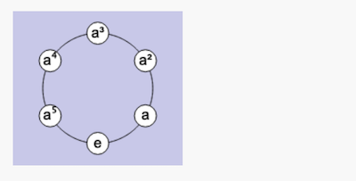
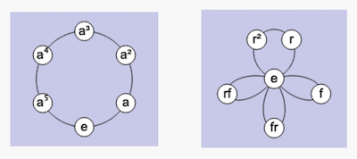
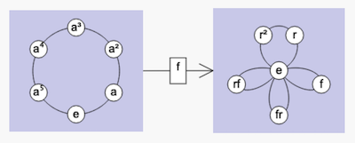
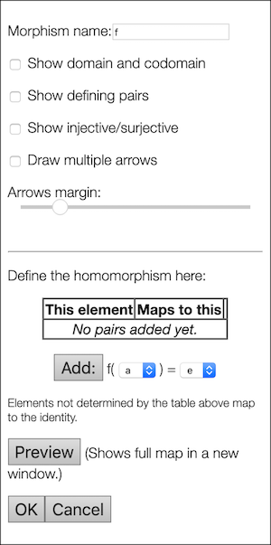
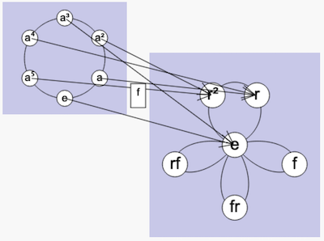
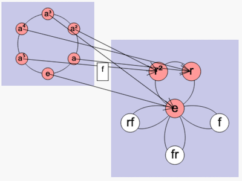
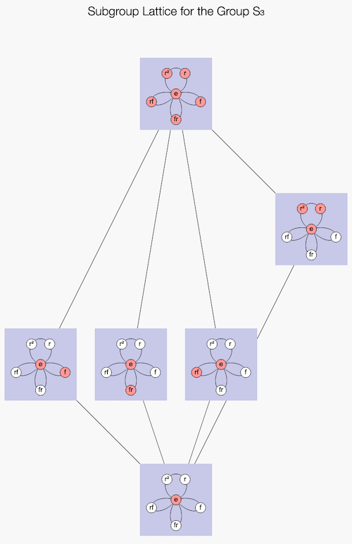
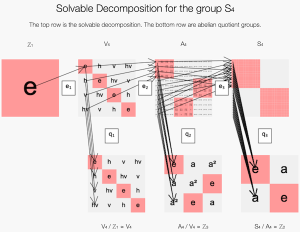

## Sheets

*Group Explorer* since version 2.0 has been able to open multiple group
visualizations in one document called a "sheet," so that they can be
compared and homomorphisms between them created, illustrated, and studied.

This page provides a quick introduction to sheets.  To go directly to the
details of the sheet interface and how to use it, [visit this page of the
User Manual](rf-um-sheetwindow.md).

Let's begin with "Making your own sheets," but you can jump down to
"[Getting Group Explorer to make sheets for
you,](#getting-group-explorer-to-make-sheets-for-you)" below, where the
fancier stuff shows up.

## Making your own sheets

Let's use a sheet to compare two groups of the same order,
[\(\mathbb{Z}_6\)](http://nathancarter.github.io/group-explorer/GroupInfo.html?groupURL=Z_6.group)
and
[\(S_3\)](http://nathancarter.github.io/group-explorer/GroupInfo.html?groupURL=S_3.group).

 * From the *Group Explorer* main page, click the Sheet icon on the top
   right hand side of the page.

    

    This creates a new sheet.

 * On the right hand side of the sheet, choose the "Cycle graph" type of
   visualizer from the drop-down list and the group \(\mathbb{Z}_6\).
   Then click the "Add this visualizer" button.  You should see a small
   copy of the cycle graph for \(\mathbb{Z}_6\) appear on the left of the
   sheet.  I resized mine slightly and the result was as follows.
   (To resize a visualizer, click to select it, then drag a corner.)

 * But that's just one visualizer; we want to have at least two.
   So let's repeat the same steps for inserting a cycle graph for
   \(S_3\) as well, but move it a little to the right of the first one,
   as shown below.

 * Now let's start comparing these groups.
   In group theory, the means of examining relationships between groups
   is via [homomorphisms](rf-groupterms.md#homomorphism).
   So let's create one in this sheet, as follows:
    * Click the left cycle graph to select it.
    * Click the "Map to" button (which by default assumes you're creating
      a "map" (homomorphism) to the other visualizer in the sheet).
    * You should see a new function \(f\) appear, connecting the two graphs.

 * So far this isn't very informative, but if we double-click the
   homomorphism we can do all sorts of interesting things.
   For instance, you can decide which elements from \(\mathbb{Z}_6\)
   should correspond to which elements from \(S_3\).
   Furthermore, *Group Explorer* will not let you mess this up
   (you cannot define a non-homomorphism.)  The morphism editing dialog
   is shown below.

 * The homomorphism defaults to the zero map
   (all elements map to the identity, in this case \(e\))
   but you can change it, of course. I will map \(a\) to \(r\)
   and then check the "Draw multiple arrows" box above.
   The result is the following illustration of one way to map
   \(\mathbb{Z}_6\) to \(S_3\).

The arrows require some attention to follow carefully, but you can see how
the six-element circle marches around the little three-element circle twice.
I've taken the liberty of highlighting \(\mathbb{Z}_6\) red and its
[image](rf-groupterms.md#image-of-a-subset-under-a-morphism) in \(S_3\) red also. (To do so,
double-click either of the visualizers and play with its subsets [as
documented here](rf-um-subsetlistbox.md).)

This is only the beginning of the potential of sheets. The next section
shows much more.

## Getting *Group Explorer* to make sheets for you

The [group info pages](rf-um-groupwindow.md) of *Group Explorer* are full of
links that create sheets. For many common computations, it is very
interesting to be able to see the result of the computation visually. I will
whet your appetite for such illustrations by giving a few examples here, and
providing links for you to browse further yourself.

 * To see a [short exact sequence](rf-groupterms.md#short-exact-sequence) exhibiting the
   [normality](rf-groupterms.md#normal-subgroup) of a
   [subgroup](rf-groupterms.md#subgroup)
   (and the [quotient group](rf-groupterms.md#quotient-group) it computes):
    * Try the "tell me more" link next to "Subgroups" in the
      "Computated Properties" section of the
      [group info page](rf-um-groupwindow.md#computed-properties).
    * Then find the subgroup in question on the list and follow the link
      provided.
    * The illustration below shows the normality of \(V_4\) in \(A_4\).

 * To see a [lattice of subgroups](rf-groupterms.md#lattice-of-subgroups)
   for a given group:
    * Again, go to the "tell me more" link next to "Subgroups"
      in the group info page.
    * Follow the link provided at the top of the resulting page,
      offering to create a sheet showing the lattice of subgroups.
    * The illustration below shows all subgroups of \(S_3\).

 * To see the [solvable decomposition](rf-groupterms.md#solvable-group-solvable-decomposition) of any
   [solvable group](rf-groupterms.md#solvable-group-solvable-decomposition):
    * Follow the "tell me more" link next to "Solvable"
      in the group info page.
    * The decomposition will be reported in text and you can click and of
      several links on that page to see it illustrated in various ways.
    * The illustration below shows the solvable decomposition for \(S_4\).

